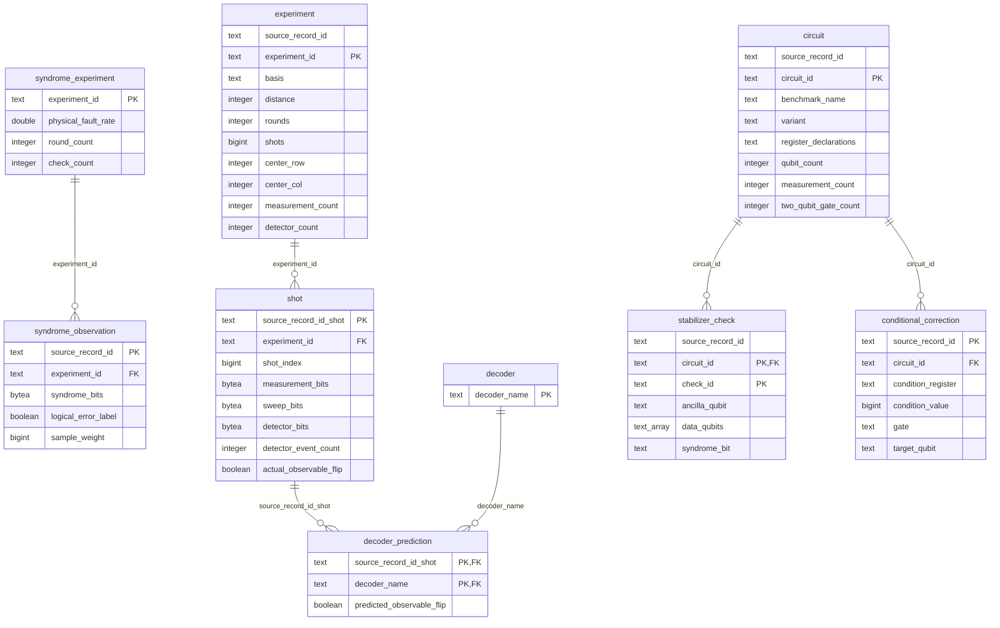

# Decision log
## Bronze 

### Analysis test coverage

## Silver

### Analysis test coverage
Repeated runs are safe

## Gold 
The relationship scheme of our Gold model looks as follows:

We did value checks on a lot of the attributes of the model, as well as added indexes on instances in tables.

We made some decisions that make this model different from our Gold model, which we explain below. 

### Syndrome Observation
One row represents one weighted source observation; identical patterns may have different labels.

`source_record_id` is unique for all entries of the Syndrome Observation table, so we picked that as our primary key for this table. We decided not to create an extra, more human-readable ID, as that would require more storage.

`experiment_id` is the foreign key to Syndrome Experiment.

#### Design Choice
We decided to split Syndrome into observations and experiments. Observations and experiments were split, as those are two different things in essence. Now, less storage is necessary for the syndrome observations, as all information related to the seven types of experiments is in a different table.

### Syndrome Experiment
One row represents one source-specific synthetic fault-rate experiment.

`experiment_id` was unique for all instances of  Syndrome Experiment, so we used that as our primary key.

### Experiment
One row represents one hardware experiment directory.

`experiment_id` was unique for all entries of the Experiment table and a bit more human-readable than `source_record_id`, so we picked that as our primary key for this table. 

Other than that, the table stayed the same with regard to the Silver table.

### Shot
One row represents one aligned hardware shot.

`source_record_id` was unique for all entries of the Shots table, so we picked that as our primary key for this table. We decided not to create an extra, more human-readable ID, as that would require more storage.

`experiment_id` is the foreign key to Experiment.

#### Design Choice
We decided to split the predictions of shots from the shot observations, as those are two different things in essence.

### Decoder Prediction
One row represents one predicted observable flip by one decoder for one shot.

`source_record_id_shot` and `decoder_name` together form the primary key, as is explained by the meaning of one row.

`source_record_id_shot` is the foreign key to Shot.

`decoder_name` is the foreign key to Decoder.

#### Design Choice
For the Decoder and Decoder Prediction tables, we considered two different options. 

##### Option 1
The first option was a table that looked like this:

| Belief Matching Prediction | Belief Matching Correctness | Correlated Matching Prediction | Correlated Matching Correctness | Pymatching Prediction | Pymatching Correctness | Tensor Network Contraction Prediction | Tensor Network Contraction Correctness |
|----------------------------|-----------------------------|--------------------------------|---------------------------------|-----------------------|------------------------|---------------------------------------|----------------------------------------|
| Instance value 0           | Instance value 1            | Instance value 2               | Instance value 3                | Instance value 4      | Instance value 5       | Instance value 6                      | Instance value 7                       |

##### Option 2
Our other option looked like this:

| Prediction ID    | Decoder Name     | Prediction       |
|------------------|------------------|------------------|
| Instance value 0 | Instance value 1 | Instance value 2 | 

Together with a table:

| Decoder Name               |
|----------------------------|
| Belief Matching            |
| Correlated Matching        |
| Pymatching                 |
| Tensor Network Contraction |

We decided to go for option 2. We thought about adding our own prediction algorithm, so making it more scalable, and how that would easiest. 
This was way nicer in option 2, as that would require adding extra rows, whereas in option 1 it would require adding extra columns, therefore changing the application-visible schema itself.

### Decoder
One row represents one decoder algorithm.

`decoder_name` is unique for all instances of Decoder, so we used that as our primary key.

### Circuit
One row represents one circuit variant.

`circuit_id` was unique for all entries of the Circuit table and a bit more human-readable than `source_record_id`, so we picked that as our primary key for this table.

Other than that, the table stayed the same with regard to the Silver table.

### Stabilizer Check
One row represents one parity/stabilizer check identified in a circuit.

`check_id` was unique for all entries of the Stabilizer Check table and a bit more human-readable than `source_record_id`, so we picked that as our primary key for this table. 

`circuit_id` is the foreign key to Circuit.

Other than that, the table stayed the same with regard to the Silver table.

### Conditional Correction
One row represents one recovery operation controlled by a measured syndrome.

`source_record_id` was unique for all entries of the Conditional Correction table, so we picked that as our primary key for this table. We decided not to create an extra, more human-readable ID, as that would require more storage.

`circuit_id` is the foreign key to Circuit.

Other than that, the table stayed the same with regard to the Silver table.

### Analysis test coverage

`tests/test_gold.py` runs the production Gold DDL, loader, and committed
`queries/query1.sql`, `query2a.sql`, `query2b.sql`, and `query3.sql` against real
PostgreSQL with small deterministic fixtures.

| Requirement in the assignment brief | Test evidence |
| --- | --- |
| Weighted syndrome frequencies and labels (§ Part I analysis, question 1) | Unequal weights, the same pattern under both labels, two fault rates, exact expected rates, and frequencies summing to one per rate. |
| Decoder comparisons (question 2) | All four decoders; perfect, always-wrong, and constant predictions; unequal experiment sizes to detect unweighted averaging; distances 3/5, distance-three locations, and separate basis/round groups. Both SQL files execute the required three-table join. |
| Repetition-code mapping (question 3) | Exact six check–correction rows, including qubit pairs, ancillas, syndrome bits, conditions, and targets; other circuits, transpiled variants, and unrelated syndrome registers are excluded. Two rows describe each whole-register condition together, not independent triggers. |
| Stable records on repeated Gold loads (§ Gold design) | Compare every Gold table after two loads; verify counts, retained source IDs and packed bytes, weights, four predictions per shot, and the correctness view. One-row batches exercise multiple COPY batches. |
| Part I succeeds twice without duplicate business records or changed stable identifiers (submission checklist) | `tests/test_rerun.py::test_gold_records_and_identifiers_are_unchanged_on_a_second_run` runs `pipeline.run_part1()` twice over the same miniature release in one disposable database. Every Gold table must be populated after the first run; complete row snapshots, including identifiers, must match after the second, ignoring row order but preserving duplicate counts. This complements the Silver/trace rerun checks; it is fixture-based coverage, not evidence of two full-release runs. |
| All-or-nothing Gold update (§ Gold) | After missing input, a database constraint failure, or failed shot-count reconciliation, every previously committed Gold table remains unchanged. |
| Database integrity (§ Gold design) | Reject duplicate observation IDs, orphan shots/predictions/checks, nonpositive weights, wrong-length/nonbinary syndromes, empty data-qubit lists, and negative correction conditions. |
| Pipeline-to-Gold handoff | A fresh miniature release reaches Gold using explicitly supplied settings despite conflicting ambient lake settings; all six loaded table counts match newly published Silver. A partial parser run leaves every Gold table unchanged. |

The loader regression initially failed because Silver temporary tables were
created twice. Staging now happens once and returns its Parquet row count for
reconciliation. These tests cover local Silver-to-Gold and analysis semantics;
they do not establish full-release pipeline, MinIO streaming, Gold-to-ML export, or
end-to-end prediction tracing coverage.

The rerun suite exposed a separate handoff bug: the pipeline re-read ambient
configuration and invoked Gold before publishing its new Silver files. Tests
therefore reached the real course dataset, with concurrent loads waiting on the
Gold advisory lock. The pipeline now passes its run settings and publishes Silver
before loading Gold. Partial source runs leave Gold untouched rather than loading
a mixture of new and old sources. Gold replacement remains one transaction;
Silver publication and Gold replacement are not a cross-storage transaction.

The shared `database` fixture in `tests/conftest.py` isolates Gold tests and every
pipeline-invoking rerun/schema test in disposable databases, without stubbing the
loader. Connection attempts have a five-second timeout.

With the course PostgreSQL service running, run from `starter`:

```sh
make test
```

Gold tests run by default using the course credentials from `Settings` and respect
the `POSTGRES_*` environment variables. The default test host is `localhost` for
host-side runs; the Compose workspace supplies `POSTGRES_HOST=postgres`.
`TEST_POSTGRES_DSN` remains an optional override for a different test server.
The connected role must be permitted to create databases.

Each test creates a uniquely named `test_gold_*` database and drops it in cleanup;
the course database's Gold schema is not modified. Missing or unreachable
PostgreSQL now fails the tests instead of silently skipping Gold coverage.

## ML 
Create example_id as is required in [the Markdown file on ML tables.](../../../../assignment/required-ml-tables.md)
