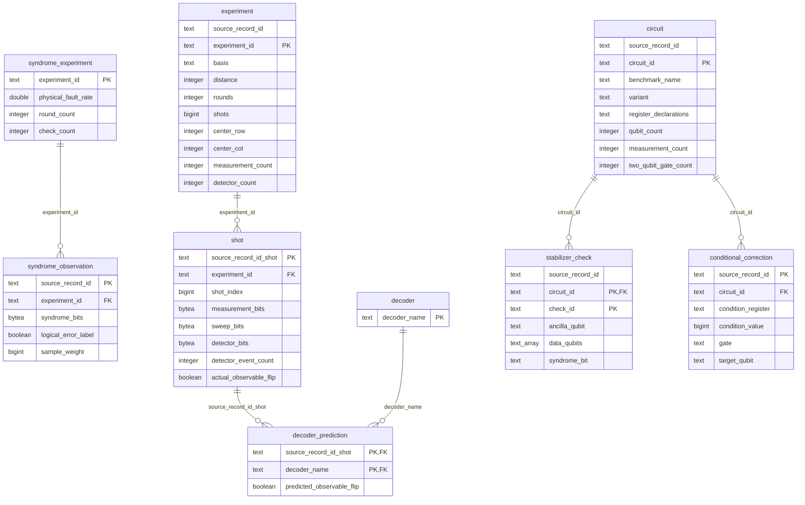

# Decision log
## Silver

### Possible Mistakes Covered by Tests
Repeated runs are safe

## Gold 
The relationship scheme of our Gold model looks as follows:

We did value checks on a lot of the attributes of the model, as well as added indexes on instances in tables.

We made some decisions that make this model different from our Gold model, which we explain below. 

### Syndrome Observation
One row represents one weighted source observation; identical patterns may have different labels.

`source_record_id` is unique for all entries of the Syndrome Observation table, so we picked that as our primary key for this table. We decided not to create an extra, more human-readable ID, as that would require more storage.

`experiment_id` is the foreign key to Syndrome Experiment.

#### Design Choice
We decided to split Syndrome into observations and experiments. Observations and experiments were split, as those are two different things in essence. Now, less storage is necessary for the syndrome observations, as all information related to the seven types of experiments is in a different table.

### Syndrome Experiment
One row represents one source-specific synthetic fault-rate experiment.

`experiment_id` was unique for all instances of  Syndrome Experiment, so we used that as our primary key.

### Experiment
One row represents one hardware experiment directory.

`experiment_id` was unique for all entries of the Experiment table and a bit more human-readable than `source_record_id`, so we picked that as our primary key for this table. 

Other than that, the table stayed the same with regard to the Silver table.

### Shot
One row represents one aligned hardware shot.

`source_record_id` was unique for all entries of the Shots table, so we picked that as our primary key for this table. We decided not to create an extra, more human-readable ID, as that would require more storage.

`experiment_id` is the foreign key to Experiment.

#### Design Choice
We decided to split the predictions of shots from the shot observations, as those are two different things in essence.

### Decoder Prediction
One row represents one predicted observable flip by one decoder for one shot.

`source_record_id_shot` and `decoder_name` together form the primary key, as is explained by the meaning of one row.

`source_record_id_shot` is the foreign key to Shot.

`decoder_name` is the foreign key to Decoder.

#### Design Choice
For the Decoder and Decoder Prediction tables, we considered two different options. 

##### Option 1
The first option was a table that looked like this:

| Belief Matching Prediction | Belief Matching Correctness | Correlated Matching Prediction | Correlated Matching Correctness | Pymatching Prediction | Pymatching Correctness | Tensor Network Contraction Prediction | Tensor Network Contraction Correctness |
|----------------------------|-----------------------------|--------------------------------|---------------------------------|-----------------------|------------------------|---------------------------------------|----------------------------------------|
| Instance value 0           | Instance value 1            | Instance value 2               | Instance value 3                | Instance value 4      | Instance value 5       | Instance value 6                      | Instance value 7                       |

##### Option 2
Our other option looked like this:

| Prediction ID    | Decoder Name     | Prediction       |
|------------------|------------------|------------------|
| Instance value 0 | Instance value 1 | Instance value 2 | 

Together with a table:

| Decoder Name               |
|----------------------------|
| Belief Matching            |
| Correlated Matching        |
| Pymatching                 |
| Tensor Network Contraction |

We decided to go for option 2. We thought about adding our own prediction algorithm, so making it more scalable, and how that would easiest. 
This was way nicer in option 2, as that would require adding extra rows, whereas in option 1 it would require adding extra columns, therefore changing the application-visible schema itself.

### Decoder
One row represents one decoder algorithm.

`decoder_name` is unique for all instances of Decoder, so we used that as our primary key.

### Circuit
One row represents one circuit variant.

`circuit_id` was unique for all entries of the Circuit table and a bit more human-readable than `source_record_id`, so we picked that as our primary key for this table.

Other than that, the table stayed the same with regard to the Silver table.

### Stabilizer Check
One row represents one parity/stabilizer check identified in a circuit.

`check_id` was unique for all entries of the Stabilizer Check table and a bit more human-readable than `source_record_id`, so we picked that as our primary key for this table. 

`circuit_id` is the foreign key to Circuit.

Other than that, the table stayed the same with regard to the Silver table.

### Conditional Correction
One row represents one recovery operation controlled by a measured syndrome.

`source_record_id` was unique for all entries of the Conditional Correction table, so we picked that as our primary key for this table. We decided not to create an extra, more human-readable ID, as that would require more storage.

`circuit_id` is the foreign key to Circuit.

Other than that, the table stayed the same with regard to the Silver table.

## ML 
Create example_id as is required in [the Markdown file on ML tables.](../../../../assignment/required-ml-tables.md)
